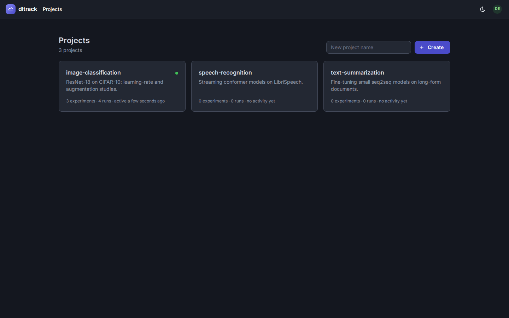
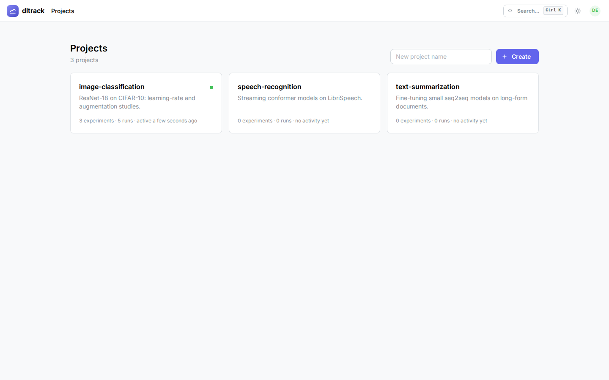
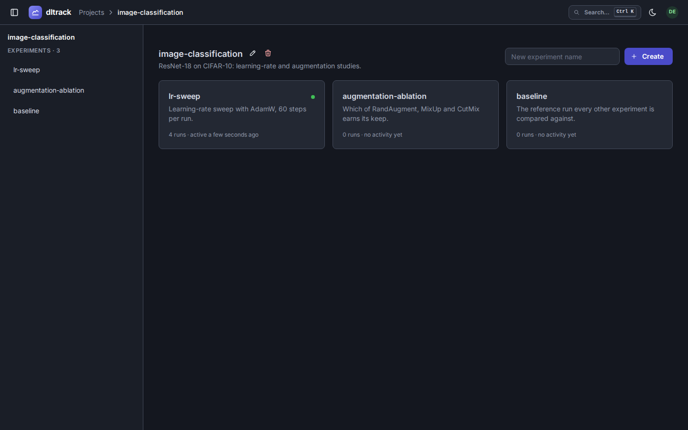
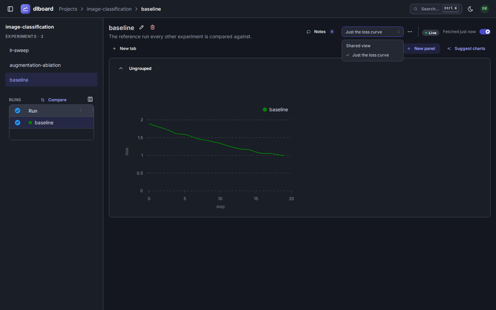
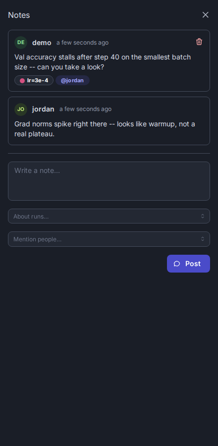
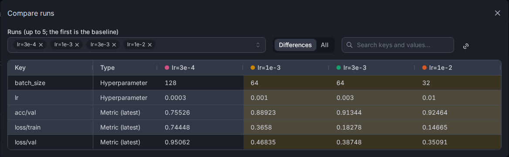
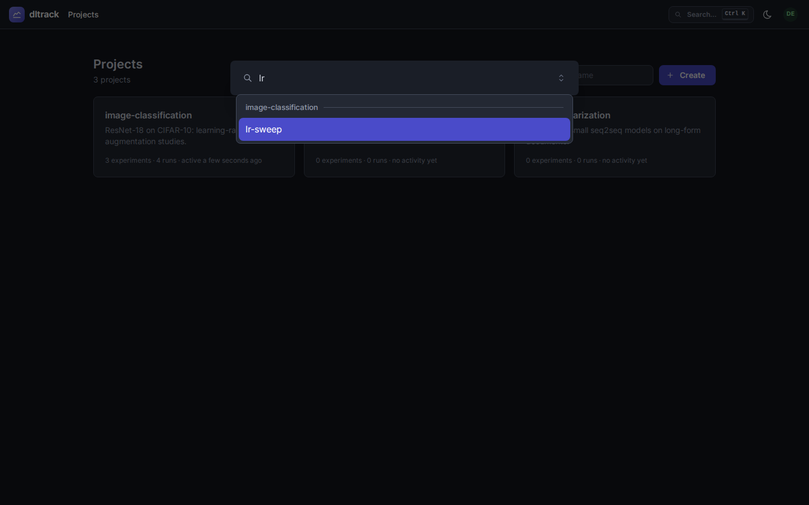

# dlboard

[](https://opensource.org/licenses/Apache-2.0)
[](https://pypi.org/project/dlboard/)
[](https://pypi.org/project/dlboard-client/)
[](https://github.com/dlangerm/dlboard/actions/workflows/ci.yml)

**A free, self-hosted ML experiment tracker** that's as easy to run as TensorBoard, purpose-built for comparing runs and scaling to teams, large and small.

Browse experiments side-by-side, compare metrics across runs, track hyperparameters, and log artifacts — all without leaving your infrastructure. dlboard is a modern web UI built on Dash/Dash-Mantine, with a PyTorch Lightning logger client that ships metrics and artifacts to your server over a REST API.

## Quick Start

### 1. Install

dlboard is two packages. Install whichever matches the machine:

```bash
pip install dlboard                       # the server and the `dlboard` command (includes the client)
pip install "dlboard-client[lightning]"   # just the logger, for a training environment
```

They don't need to be on the same machine: install `dlboard` where you want to browse runs, and
`dlboard-client[lightning]` wherever you train. Postgres and S3 support are extras of the server:
`pip install "dlboard[postgres,s3]"`.

### 2. Run

```bash
dlboard serve local
```

That's it. Visit `http://localhost:8050` and you'll have a clean, modern experiment tracker running locally with SQLite and local disk storage — no database setup, no configuration needed.

### 3. Log a training run

Point your training script at the running server:

```python
from dlboard.client.dlboard_logger import DLBoardLogger
import pytorch_lightning as pl

logger = DLBoardLogger.from_names(
  project_name="character-classification",
  experiment_name="mnist",
)

trainer = pl.Trainer(logger=logger, ...)
trainer.fit(model, dataloader)
```

Every metric, hyperparameter, and artifact you log gets synced to dlboard in the background.

## Features

- **One-command setup** — `dlboard serve local` with zero configuration
- **Side-by-side run comparison** — compare metrics, hyperparameters, and artifacts across any runs, or diff up to five runs in a shareable modal
- **PyTorch Lightning integration** — drop in `DLBoardLogger` and you're done
- **Personal views** — save custom layouts and filters without touching the shared experiment page
- **Artifact streaming** — log images, plots, and structured data; browse them in the UI
- **Multi-project support** — organize experiments by project
- **Light & dark mode** — built with Dash-Mantine for a modern UI
- **Lightweight client** — the Python client has minimal dependencies (no torch required unless you use Lightning)

## See It In Action

**Compare runs side-by-side** — Filter, sort, and compare runs without losing context:


**Projects & experiments** — Browse all your projects, see experiment results at a glance:








**Step through artifacts** — View confusion matrices, learning curves, or any images logged during training:


**Personal views** — Customize layouts per-user without affecting what others see (or share it with them with a click of a button):



**Collaborate with notes** — Leave notes on experiments, calling out specific runs or teammates by name:



**Compare runs** — Pick up to five runs and diff their hyperparameters and latest metrics in a modal; the URL carries the whole comparison, so you can share it:



**Quick jump** — Search experiments by name with Ctrl+K:



## Deployment

**Local development** is just `dlboard serve local`. For production deployments:

- **Docker** — See [docs/docker.md](docs/docker.md) for building an image with Postgres + S3 support
- **Custom plugins** — Bring your own storage backend, auth provider, or chart types:
  ```bash
  dlboard serve custom --plugins mypackage.deployment:PLUGINS --workers 4
  ```
  See [docs/plugins/overview.md](docs/plugins/overview.md) for the plugin protocol.
- **Multi-user with auth** — Swap in `dlboard.plugins.PASSWORD_AUTH` for user sign-in and API tokens. See [docs/plugins/auth.md](docs/plugins/auth.md).

## Development

Everything runs through [`uv`](https://docs.astral.sh/uv/) (Python >=3.12):

```bash
uv run --env-file .env dlboard serve local     # start the server
uv run pytest                       # run the test suite
uv run pytest -m browser            # run only the browser/e2e tests
uv run pytest --screenshots=update  # regenerate the docs screenshots in docs/images
uv run ruff check && uv run ruff format   # lint / format
uv run pyright                      # type check
uv run prek run --all-files         # run pre-commit hooks manually
```

## Learn More

- [Architecture](docs/architecture.md) — how the app is put together: the plugin system, and the
  request flow from a training script to the browser.
- [Client & logging](docs/client.md) — `DLBoardLogger`, the REST client, and how to log a new kind
  of artifact.
- [Docker](docs/docker.md) — building and running the image, its Postgres + local-disk default, and
  configuring it (including swapping in S3).
- **Running it in production**
  - [Configuration](docs/configuration.md) — every environment variable
  - [Reverse proxy & TLS](docs/reverse-proxy.md) — Caddy and nginx examples
  - [Upgrading](docs/upgrading.md) and [Backup & restore](docs/backup.md)
  - [Compatibility](docs/compatibility.md) — what's stable across releases and what may still change
- **Plugins** — dlboard has no built-in opinions about storage, auth, charts, or theming; all of
  it is plugins. (Page layout is the one deliberate exception — see
  [architecture.md](docs/architecture.md).) Start with the
  [overview](docs/plugins/overview.md), then the category you need:
  - [Storage](docs/plugins/storage.md) — where projects/runs/metrics and artifact blobs live
  - [Charts](docs/plugins/charts.md) — how a metric/artifact gets turned into a rendered chart
  - [Auth](docs/plugins/auth.md) — signing people in, API tokens, and who can see which projects
  - [Themes](docs/plugins/themes.md) — the Mantine theme the app renders with

## Contributing

Pull requests are welcome. See [CONTRIBUTING.md](CONTRIBUTING.md) for setup and expectations.

The project follows these principles:
- **Code quality over volume** — all PRs are reviewed and understood before merging
- **AI-generated code is welcome** — but hold it to the same standard as hand-written code
- **Keep it small** — large features are split into reviewable stacks

## AI Usage

I started dlboard as a personal project coded by yours truly. As I went down the rabbit hole of implementation I realized
I was spending a _ton_ of time twiddling with webdev instead of actually doing useful work. At some level, experiment
tracker libraries live and die by their browser experience and their offered feature set. I set out to make a free, open-source
tool that I actually wanted to use for my own projects. Making something I actually wanted to use became a behemoth of
wiring up dash app components in ways that were performant and made sense. So, I decided that it'd be better to get an app
out the door into hands of users than it would be to do everything by hand.

So, is the app coded in a way I personally would have written it? Absolutely not. Does it work and provide value today instead of 6 months
down the line? Yeah, it does. However, I remain a healthy skeptic of AI generated code. Therefore, I will only accept PRs (for now) that I myself
can review and understand. That means contributors to this library need to hold their tools to a high standard and follow
best practices for submitting PRs and features just like you would if you had coded it yourself.

tl;dr
Can I submit AI vibe-coded-PRs for plugins I want that I think are useful to the community? Yes you can.
Will I give serious reviews and (if they're too big) ask you to split features up into a stack up so I can review them properly? Also yes.
