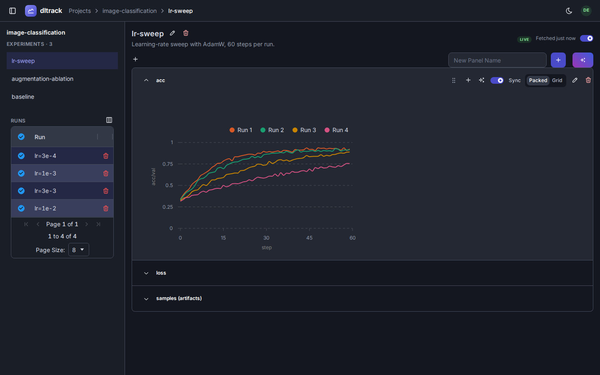
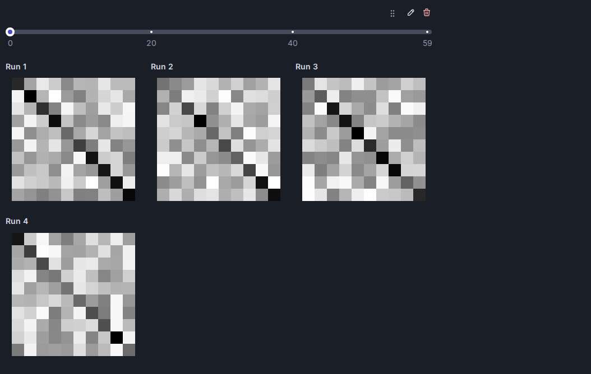

# Chart plugins

## What is this

A chart plugin defines one `ChartType` — a way to turn parameters and a dataframe of logged data
into a rendered Dash component. `ChartType[P, D, C]` (`dlboard/models/_view.py`) is generic over
its parameter model `P`, the data shape it renders from `D`, and the rendered component type `C`.
Built-ins: `line_chart.py`, `bar_chart.py`, `table_chart.py`, `image_series.py`, `file_list.py`
(`dlboard/plugins/charts/`). `file_list.py` is what an artifact a browser can't show inline gets (a
checkpoint, say): its files by run and step, each with a download link. It is paged and sortable, and
splits files into tabs by what they are -- for the checkpoints `DLBoardLogger` uploads, `Latest`, `Best`
and `Top-k`, read from the `tag` and `score` tags the logger records. Set `key_prefix` (say
`checkpoints/`) instead of `key` and one chart lists every key under it, so a run's hundreds of
checkpoints (one key apiece) are one list, and Auto-generate makes exactly that.

The built-in line charts, and the image series that steps through logged images:





## When you'd need this

You want a new way to visualize logged metrics/artifacts that the built-in line/bar/table/image
charts don't cover — a histogram, a scatter plot, a confusion matrix, anything with its own
parameter shape and rendering.

## How do I build one

Subclass `ChartType` and implement its abstract methods:

- `name: ClassVar[str]` — the registry key. Must be unique (see below).
- `parameter_type() -> type[P]` — the Pydantic model describing this chart's settings.
- `render(parameters, dataframe) -> C` — turn one instance into a Dash component.
- `hint_required_columns` / `hint_required_artifact_keys` / `hint_required_hparams` — tell the
  chart-autogen logic (`dlboard/serve/_pages/_experiment/_chart_autogen.py`) what a logged run
  needs before this chart type is even offered.
- `hint_required_artifact_key_prefixes` (optional, none by default) — for a chart that lists a whole
  family of artifacts (every `checkpoints/...` key) rather than named ones: every key starting with one of
  these is fetched, including keys logged later.
- `field_column_kinds()` — map each parameter field to the `ColumnKind` (metric/artifact/hparam)
  that populates it, so the settings UI knows what to offer as choices.
- `can_display_artifact(artifact) -> bool` (optional, `False` by default) — say which logged artifacts this
  chart type can display. Auto-generating and suggesting charts give an artifact key the first built-in
  chart type that says yes; an artifact no chart type claims simply gets no generated chart.

`plug(app)` registers the class and, if the chart needs its own clientside JS (a tooltip
formatter, say), serves it from a route this plugin owns:

```python
def plug(app: Dash) -> None:
    MyChart.register(allow_override=True)
    # optional, for chart-local JS: served from this app only, cached forever under a content hash
    serve_asset(app, AssetKind.SCRIPT, _JS_PATH.name, _JS_PATH.read_bytes())
```

Always pass `allow_override=True` — the composed app can get built more than once in a process
(tests do this legitimately), and `ChartTypeRegistry.register` raises on a second registration of
the same name unless told it's expected. `line_chart.py`/`bar_chart.py`/`table_chart.py`/
`image_series.py` are all consistent about this; follow their lead.

If your chart needs its own browser-side JS, keep the `.js` file next to the chart module and
serve/register it from `plug()` yourself, the way `bar_chart.py`/`line_chart.py` do for their
tooltip formatters — never drop it in a shared `assets/` folder or use Dash's global
`hooks.route`/`hooks.script` registry, both of which leak across every `Dash` app built in the same
process, not just the one that owns the file.

`bar_chart.py` is a good mid-sized reference: one settings model, one JS tooltip asset, grouping
logic shared from `_grouping.py`.
